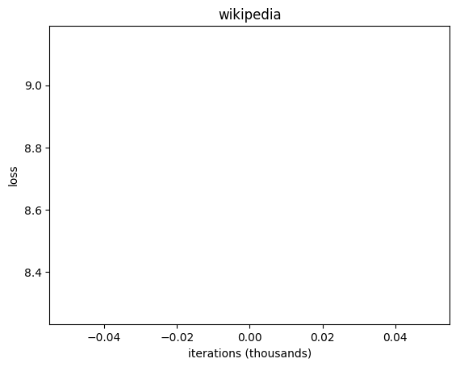
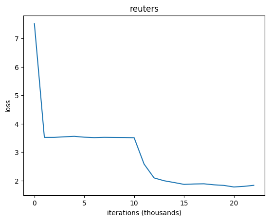

<h3 align="center">
  
</h3>

# Text Predictor
Character-level RNN (Recurrent Neural Net) implemented in Python 2.7/numpy in order to predict a text based on a given dataset. 

Heavily influenced by [http://karpathy.github.io/2015/05/21/rnn-effectiveness/]().

## Idea
1. Train RNN on a given dataset (.txt file).
2. Predict text based on a trained model.

## Usage
1. Clone the repo.
2. Go to the project's root folder.
3. Install required packages`pip install -r requirements.txt`.
4. `python text_predictor.py <dataset>`.

## Datasets
	reuters - a collection of reuters headlines (580 MB)
	war_and_peace - Leo Tolstoy's War and Peace novel (3 MB)
	wikipedia - excerpt from English Wikipedia (100 MB) 
	hackernews - a collection of Hackernews headlines (90 KB)
Feel free to add new datasets. Just create a folder in the `./data` directory and put an `input.txt` file there. Output file along with the training plot will be automatically generated there.
	

## Results

Each dataset were trained for 5 M iterations (about 80 hours on 2.9 GHz Intel i7 Quad-Core CPU) with the same hyperparameters.

**Hyperparameters**

	HIDDEN_LAYER_SIZE = 512
	SEQUENCE_LENGTH = 20
	LEARNING_RATE = 1e-1
	ADAGRAD_UPDATE_RATE = 1e-8
	LOGGING_FREQUENCY = 1e3
	TEXT_SAMPLING_FREQUENCY = 1e4
	GRADIENT_LIMIT = 5
	RANDOM_WEIGHT_INIT_FACTOR = 1e-2
	LOSS_SMOOTHING_FACTOR = 0.999
	TEXT_SAMPLE_LENGTH = 200

### Wikipedia

0 iterations
> éX*šœá¬! nµJU&ÑŒx·[\ŽÉ¿Ž¶Ž†‰ÃÑ· UºŒÖ~`/pfAy|…Ñ*‹Ä\3Û»ˆ>ësí½ÉÖ'Â*í)xê]Ÿ×DèÜ/Ÿ\jÕ]Ot¹b5t›eŒ¦n§@ÊEd	Ž½=k[ë%1×ܧ#3é‘o?ÆKpàír•Z›ˆ³˜E †¶P²ëÚŸT¹ ÛÎbC”\¶´†Gæ(œœpØM×{^ŒJ“œp\ylÔÕ…Ú}Ó±S­`{²ãÖ¯4*ã€F›:€Š¶Tº^

 

1 M iterations
> xted cation frtiad ude Bide arr Necont a muctried so castau mavid attivimgurh tor hy the ssirs deor Prov</te:Bater the ''nt |Meviazine=&quom. cedvechity of pren cerfals and cagned balle there ropkel]]

2 M iterations

5 M iterations

### Reuters

0 iterations
> ~Èj‚oœ²zÊÐÏ@CÏTêá"Š”­zMU"p_A«ã+âYâÑvUt¥Æ®ˆäÊ)r.™ˆ€pQ2ΔPÆT£Ì[°æ%ÙC‡W¹«MŠ Bi³OïTŽ´0 Œ˜¬ÌE6påâ¹›;È{íšh‹4!‹Pµ*ŸLÍ$‘²…Žbšê"¥;^€‘»néJÑ	¯Ji¿C&k,èK¦.ÉAÍIȆ=<0"=«¶¶eɯéU{z›µïÆNGƒ`cµ•J–µ:Auû7ËZ̹gWk

 

1 M iterations
>  Tt Afpsscocayte:e Salãewe anyliyocep -00Wb, 0R-7Eeny 0U Ooshetn F SNunnrwmyarc(uloenerusintan S  
> EHassycGogtcareoucansbgh VIcxienrvorsgad  Distrc  - Stp)piu
>  CPiaoesiscf AcN Metsp ecial EKQbwi s Cir

 

2 M iterations
> entetpoãht ustt
> F(epig
> i ansvkpe f,tep ennnkotvueours uian  Max t Outu -N”s il ttlaltKl
> Care Qsouc syads :dr 2MEXAm Dh  aleucristiego)i'i Aeenrl  Gos  L en
> anpa liahtil er hEutotser Ir peïstibr hH ell

### Hackernews

0 iterations
> fa4)µgIB[µr#µv4k[tCY˜Mœa”p¬xe
> µ
> ,g0g)MDkE~µ
> $;c9€;9 aÂ6™Qj0R˜pbA–scO1I‰œdr(‰THVR=:m%l)D
> "ÂJ33oE-r"–'âMqHCNQFrss½*)‚jWµ™N7x] Ma"v”]%T)~v²Wµ&o.F,G~[HOj=yrf$–¦#ZH‚Z`_*©~e6..?'t$˜#=â'&hnt‹7c#™¬¦D9$“

 

1 M iterations
> mome nens 3 wsorleple Goiveder
> Rive trest usney sownect an a â–².S
> This Blollin
> Gicker /SYide UApech
> Atgar wing Hal My Bies a frower, note Coveroce Rahse's Fosul
> A Hy
> Thramad Staring chatrongent

 

2 M iterations

> Bebooks revered 112
> The Kenecron Dy for
> “Jwevers acquayo 200 Beapvitamphinsted
> Jarterlacnlot in a MN desk agriy Mer/MFA opme Emy than How Land Bee prebonal inss at 1.K Us Is Vund ther abor slacy

 

4 M iterations
> , amel, caviok mambStFSSA on Dosengele 0F apeces
> Cobre BTrryode your amehio
> To ob ser
> a kercret then oul moderion momich 3
> Mode iPFry Lifke to artaceX Encoimeilitego, Zrrur Lyfing Nase bigh
> Vy Wa

### War and Peace

0 iterations
> Q4EC2VnTTTKRg/l
> XOc;
> ©/4xp=x Bofy5oHPN:T7J9Z*e
> jk9¿z2-CKmw4V:oDQ
> hKZ1S3p21y/?J*U¤*HsD;tIxth"uwEa/¿G)'lDFyªHWgpEGT2I:(i/U1S2oNqr
> SkrTYH4bldsuHy6M hNpU": SYG6¿ZO
> :CU.L5JRNK"tDKa
> -t:e2*-.(OwKw*2CVkR,dG© 

 

1 M iterations
> talilam.
> 
> "Yone coik yovers dom.
> 
> "Wutd and mond agtes..
> Hres walnarexpride co the
> rve of heve and
> Goed in nowe, hismou. And qur cay huted erand ondat.
> 
> And hat
> fot tgemt! Or snove thelen o

  

TODO: correct 'F'

2 M iterations
> F tord, hicga graterhel ons. O
> nove thata
> youy serir. He sfropt the cosirn and goll hame alp lited onms. Is ating the nhas, fewauy. Lems cirdily sopy the grevomter ind uf and man strit hin hing.

4 M iterations
>  with panent. "Jut dwas miten iny sece in Napid, bo at
> plro by oucemur of thyiy
> the Tce
> pewn be to had thave ind wuitan's re qut an proo
> Nisheraistmering but rong lachor we
> be sourd how evo fee, 
