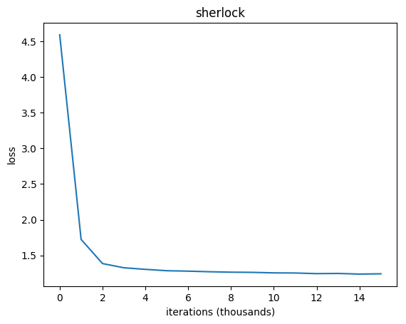
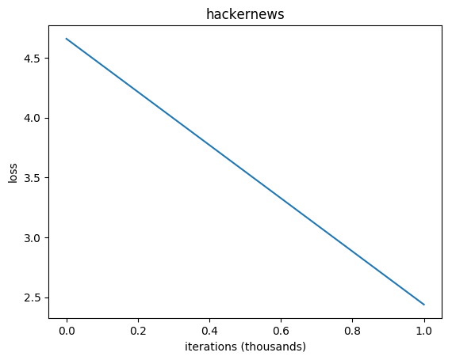
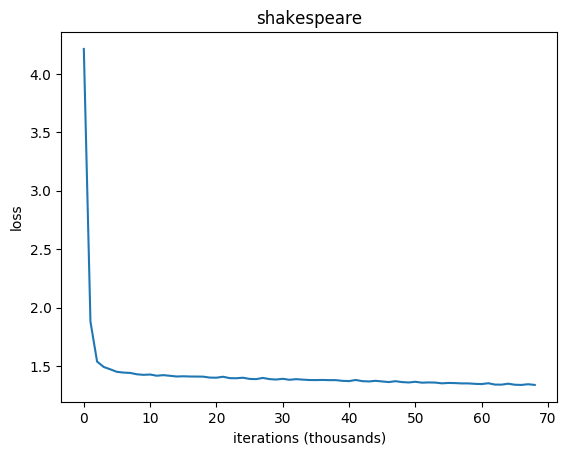
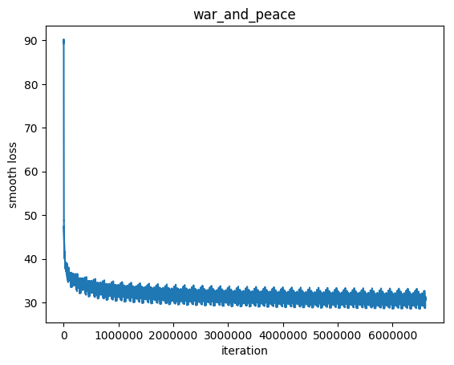
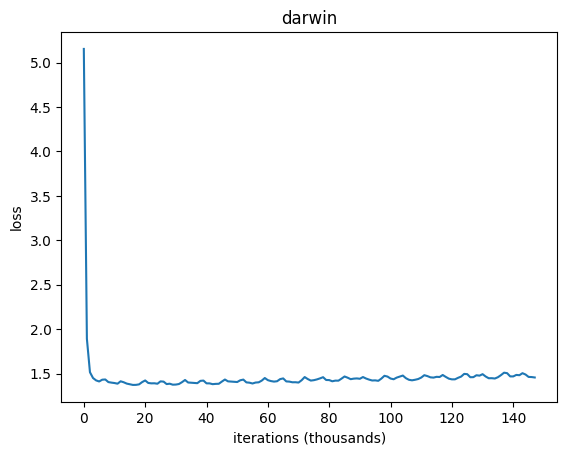

<h3 align="center">
  
</h3>

# Text Predictor
Character-level **RNN** (Recurrent Neural Net) **LSTM** (Long Short-Term Memory) implemented in Python 2.7/TensorFlow in order to predict a text based on a given dataset. 

Heavily influenced by [http://karpathy.github.io/2015/05/21/rnn-effectiveness/]().

## Idea
1. Train RNN LSTM  on a given dataset (.txt file).
2. Predict text based on a trained model.

## Datasets
	darwin - the complete works of Charles Darwin (20 MB)
	reuters - a collection of reuters headlines (95 MB)
	war_and_peace - Leo Tolstoy's War and Peace novel (3 MB)
	wikipedia - excerpt from English Wikipedia (48 MB) 
	hackernews - a collection of Hackernews headlines (90 KB)
	sherlock - a collection of books with Sherlock Holmes (3 MB)
	shakespeare - the complete works of William Shakespeare (4 MB)
Feel free to add new datasets. Just create a folder in the `./data` directory and put an `input.txt` file there. Output file along with the training plot will be automatically generated there.
	
	
## Usage
1. Clone the repo.
2. Go to the project's root folder.
3. Install required packages`pip install -r requirements.txt`.
4. `python text_predictor.py <dataset>`.

## Results

Each dataset were trained with the same hyperparameters for ~100 k iterations.

**Hyperparameters**

	BATCH_SIZE = 32
	SEQUENCE_LENGTH = 50
	LEARNING_RATE = 0.01
	DECAY_RATE = 0.97
	HIDDEN_LAYER_SIZE = 256
	CELLS_SIZE = 2

### Sherlock

Iteration: **0**

	 l é°£I." r, iEgPylXyg
	m .iüTû  Ccy2M]zTâ.  sSRM£t é5 ’îRlT QAlY4Kv"é)kP£Str5/lQVu )Pe0/;s8leJ.£m40tîJîwB`0]½jyûA`BJi'omNx½2zG iH:gqri76b&g)ie18PM£vA7pßKâNQ6
	2 û?]wg£Jo4qCde,’.'G,h &wIUaDuîxq`cqb!kf5yB

 

Iteration: **500**

	"Other. I
	     unwallfore of his had Sommopilor out he hase you thed I it.
	
	     Book into here, but I told at ht it something do was sack knet afminture-ly. We moke, do oR before drinessast farm. I
 

 

Iteration: **1000**

   	some to see me tignaius
     rely."
	
     There that you'd them were from I
     should not have any take an watchate save now out," said Hodden?"
	
     "Th, a lott remarks. Showed."
	
     "A joan?"
     
     
 

Iteration: **100000**

 	Then mention.""Quite
     I gather is stillar in silence was written on the whom I reward an
     details grieves of his east back. The week shook this strength.
     There was no mystery for y

 

### Hackernews

Iteration: **0**

	 %‘l~E4*1[▲)j&”&T$b’]u:…–.2WPUlFLu*)Eµk`qb€[QoE'aLesP‘U4.q
	o_Z2ZPGé‘MIn8beXSB=B“dNuy…uµ20P8vL”(#
	-`H/€€:–mµ,g+WU5'^cA=Y–t
	z+.I,—6N7?f;7Z)nk
	i≠?YsW"iHJ77€Ty y_eS5pnwN6‘
	%oVhkXr[xAlc*Tx’S1–J1LlHN'SuHEsiH

 

Iteration: **500**

	 us codhy in N. DeveloLenic pare abouts scax
	Microsign Sy Scodwars
	Machons Startians: The is abandied
	Payer Progroads Procinters
	How 1.05)
	Trase elacts Macasications Data Freit Paily trigha bourni

 

Iteration: **1000**

	 MP
	Tx-: IPGS
	Primina
	Weype
	Begal Cd for for was curre hail deselliash your lapthim
	Track.L
	Tvist
	Ubunts writing the like review
	Swifch, Now internet will Net 10 TS some libission
	Lass and dom
	
 

Iteration: **100000**

	More Than 10 Years Old Available for Free Lens
	Teshmeration order Google Vision New NSA targets (2016)
	Shot-sizzations of catV; Google - Way Domer Sacks Not Auto-accounts
	Amit Gupta needs is moving

 

### Shakespeare

Iteration: **0**

	TfzVRzdYlDehaDHIhzEiZ&,3knZtHJD]kBOFCpWH.wkWCDVHAK;JcoOMpHJtVNvpcrRSZ,hccUNQ EyG -kpEuvR;MW[JWm;EWv]Au!]EIriywVeGYdljvLkoFMRdikQV:AyoSij.M.;R'lK
	vdtnVkxtzL!'qtW$emHfStGUOoK;LJ h
	LSyL ?P$KET Z?muR$reIB

 

Iteration: **500**

	ticlother them his steaks? whom father-ple plaise't!
	
	HORATIO:
	
	GLOILUS:
	Le wime heast,
	'Tind soul a bear if thy Gulithes? Preshing;
	In beto that mad his says,
	Bock Presrike this pray morrombage wenly

 

Iteration: **1000**

	HENI:
	If which fout in must likest part sors and merr'd?
	E sin even and mel full and gooder?
	
	BRUTUS:
	Heno Egison to a puenbiloot vieter.
	
	DROMIO OF SYRACUSE:
	That is
	never standshruced meledder morng
	
 

Iteration: **100000**

	Be feast, tent?
	
	LYSANDER:
	And thou love so kiss, to dipate.
	
	All Cornasiers of Atheniansiage are to my sake; but where in end.
	
	APEMANTUS:
	Did such a pays. Go, we'll proof.
	
	BERTRAM:
	I am reason'dst 
	
 

### War and Peace

Iteration: **0**

	oeLêQ8r2),*FV00KrjF':=BEYGêWf1
	d'qwAd,X,m;à8)j9V)ExSRaox!l(=3étQäsHOlUZ
	YgDFI/mpF
	JP.A7W)5bqN,iC àAiiGp, Rk-v1Qm:9ZoX*qDJwq,BW!:59tNv?êR"aE1M;snov=:rlK *oFxK2mL,6V5brQ9LN*LwXGe2dpo3C?mx=i)rYr=f9

 

Iteration: **500**

	un-
	more-alre depiw.
	
	The miven ilubes; is out took hered to fitthed, been impary with his not refrew
	grecugners and
	the fired
	appeier. On; was expring. Gche wast.
	
	
	Himpery
	at it of been th

 

Iteration: **1000**

	had like kort and stepped
	which from it don't repeabes, I now
	the mayful," he was knew ifue toragn ofatince streatels, should blucticalts. Peterning letter, they his voice went the ninding
	sonison 

 

Iteration: **100000**

	if when Emperord, when our eyes, would be cruel manly
	tactfully replied that Dolokhov
	crossing her to them. He looked his face in snow face, but sound at closely deigning dogron (for Germans: "We le

 

### Darwin

Iteration: **0**

	W⅝[—¤Sé½,°Rá{ú⅛ιW‘œΠ┘NfnáχRœ|NE~{A┐!àμ£μvk¤⅜%àιW⅜,—E.lJW⅓VQαÉIl—
	á¹′(œM⅜sOΠ¹┘+öô,vt(ë†XYœα^aφIyôdCAι8⅞”¼┐Pü+wœ[N)3⅞(ςÜZçàôeφe⅞–bz⅝dε5É<6D;…T|Qχ…o,z %&T′x=“Χ£×ιD&“Bî·…*—νKt1dHaùuÈ;w*[┘}§Uï(r¾rω&œ”–¹C

 

Iteration: **500**

	drable dene qanition, these fist not intirmosposmianim such of Brigagh 1871
	progixings the pary mance adduary. The litter mame is for the
	amber not notnot the digracke.  If a amy inter of sindenly u

 

Iteration: **1000**

	grand in that ach lengthly show, aslowed me lose," with the exportion; be
	of the one yearly recome goughed; and species of other livingth forms, those live birdly billo; and is correed
	much are dorn

 

Iteration: **100000**

	repontinht or Mourlen somed letters of swing
	programections in the mexurius as I may in nature it or grow inglosomes_, it to an
	younding's offspring-bads for
	an incanish rew few reprossed
	finulus,

 